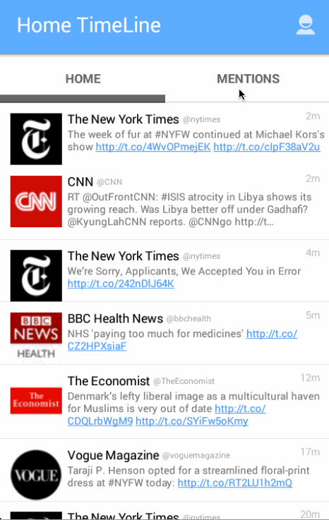

Twitter with Fragments App
=========================

This is a Twitter with Fragments app which allows a user to login to his/her account, check tweets and compose/post new tweet.

Time spent: 8 hours spent in total

## Completed user stories:

 * [x] Required: User can switch between Timeline and Mention views using tabs.
 * [x] Required: User can view their home timeline tweets.
 * [x] Required: User can view the recent mentions of their username.
 * [x] Required: User can navigate to view their own profile
 * [x] Required: User can see picture, tagline, # of followers, # of following, and tweets on their profile.
 * [x] Required: User can click on the profile image in any tweet to see another user's profile. 
 * [x] Required: User can see picture, tagline, # of followers, # of following of clicked user.
 * [x] Required: Profile view should include that user's timeline

## Walkthrough of all user stories

GIF created with [LiceCap](http://www.cockos.com/licecap/).

## Installation

* `$ git clone https://github.com/lzhan/TwitterWithFragments.git`
* use Android Studio launch the app
* Run

## Acknowledgement

This project uses the [android-async-http](http://loopj.com/android-async-http/) and the [picasso image](http://square.github.io/picasso/) libraries.

## License

The content of this project is licensed under the [MIT license](http://opensource.org/licenses/mit-license.php).

